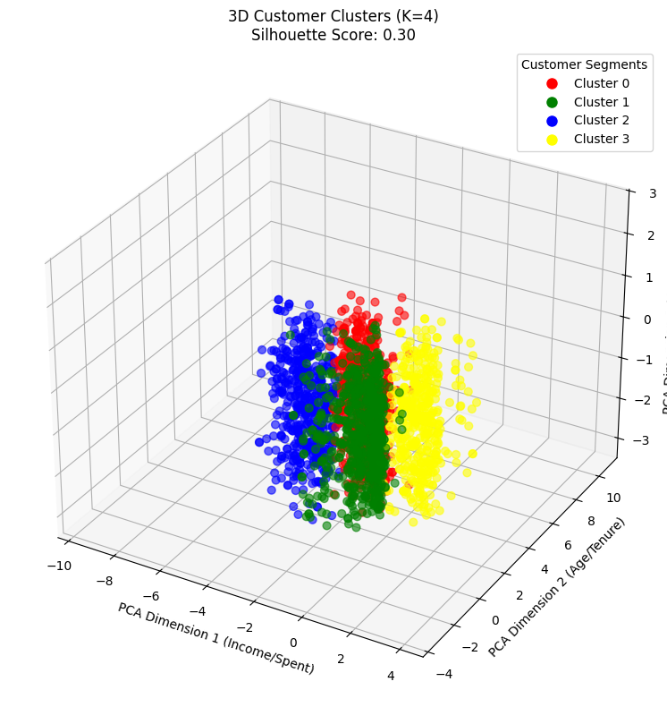
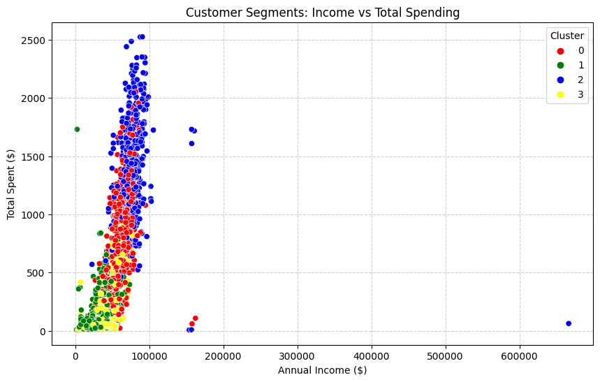

# AI-Driven Customer Personality Analysis & Segmentation 🎯

## 📌 Executive Summary
In the era of big data, generic marketing is obsolete. This project leverages **Unsupervised Machine Learning** to segment 2,240 customers into distinct personality groups. 

By analyzing behavior (spending, income, family structure), we identified **4 key customer segments**. This allows for hyper-personalized marketing strategies that can reduce acquisition costs and increase Customer Lifetime Value (CLV).

> **Note:** This project complements my work in [Industrial Quality Control (IQC)](https://github.com/programmermars/IQC-Statistical-Process-Control), demonstrating my ability to apply statistical methods across both **Manufacturing** and **Business Intelligence** domains.
data source:https://www.kaggle.com/datasets/imakash3011/customer-personality-analysis?select=marketing_campaign.csv
> 
---

## 🛠️ Technical Approach
The workflow transforms raw data into actionable business insights:

1.  **Advanced Feature Engineering**: 
    - Derived `Customer_Tenure`, `Family_Size`, and `Total_Spent` to enrich the dataset.
2.  **Outlier Detection (Isolation Forest)**:
    - Utilized `IsolationForest` to remove statistical anomalies (top 1% noise), ensuring robust clustering.
3.  **Dimensionality Reduction (PCA)**:
    - Reduced 7 dimensions to 3 Principal Components using **PCA**, retaining variance while simplifying visualization.
4.  **Clustering (K-Means)**:
    - Segmented customers into 4 clusters.
    - Validated using **Silhouette Score**.

---

## 📊 Key Results & Visualizations

### 1. 3D Cluster Visualization
*Visualizing the separation of customer groups in PCA space.*

### 2. Business Insights: Income vs. Spending
*A clear positive correlation, but with distinct behavioral boundaries.*

---

## 💡 Marketing Strategy (Actionable Insights)

Based on the cluster analysis, we recommend the following strategies:

| Cluster | Profile Description | Recommended Strategy |
| :--- | :--- | :--- |
| **0 (Red)** | **The Elite Spenders** High Income, High Spending, Low Children. | **VIP Treatment:** Offer exclusive early access to products and loyalty tiers. |
| **1 (Green)** | **Budget Families** Lower Income, High Family Size. | **Volume Discounts:** Promote "Family Packs" and BOGO (Buy One Get One) deals. |
| **2 (Blue)** | **New/Risk Customers** Variable Income, Low Frequency. | **Retention Campaigns:** Send personalized emails to re-engage before they churn. |
| **3 (Yellow)** | **Potential Upscalers** Middle Income, Moderate Spending. | **Cross-Selling:** Recommend higher-margin products based on purchase history. |

---

## 🚀 How to Run
1. Clone the repository.
2. Install dependencies: `pip install -r requirements.txt`
3. Run the modeling script: `python src/modeling.py`

## 👤 Author
**CHONG JIA YOU**
*Bachelor of Science in Industrial Statistics, UTHM*
* [LinkedIn Profile]((https://img.shields.io/badge/LinkedIn-Connect-blue?style=flat&logo=linkedin)](https://www.linkedin.com/in/jia-you-chong-860701356))
## 👏 Acknowledgements
This project was inspired by the work of **Karnika Kapoor** on Kaggle. 
Original Notebook: [Customer Segmentation: Clustering 🛍️🛒🛒](https://www.kaggle.com/code/karnikakapoor/customer-segmentation-clustering)
